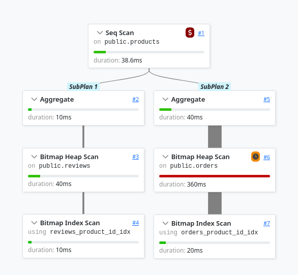
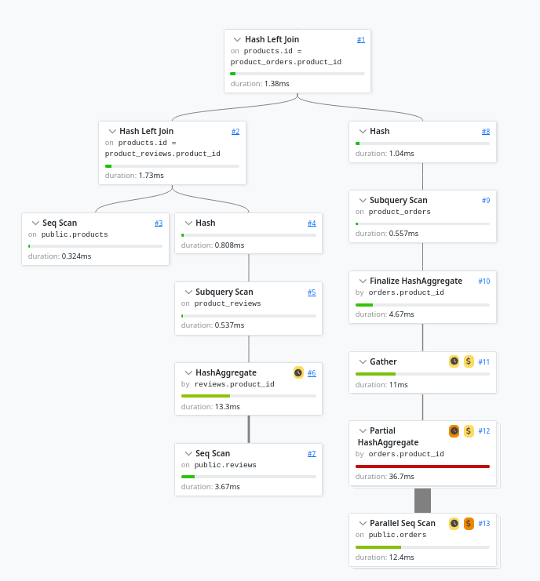
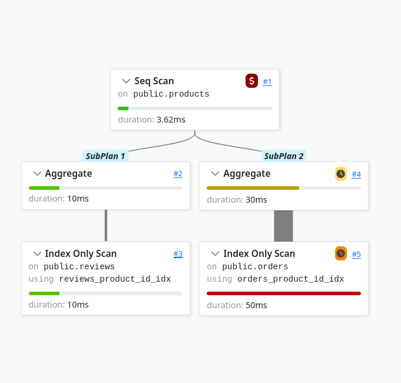
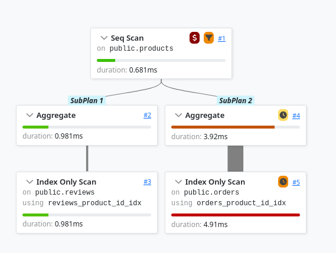
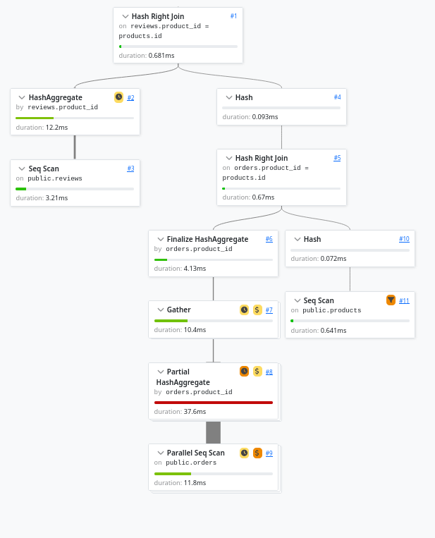
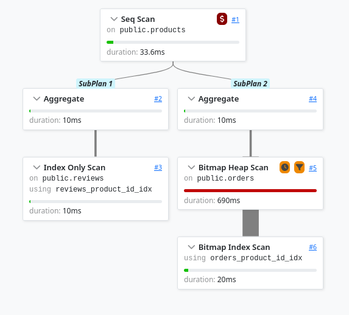
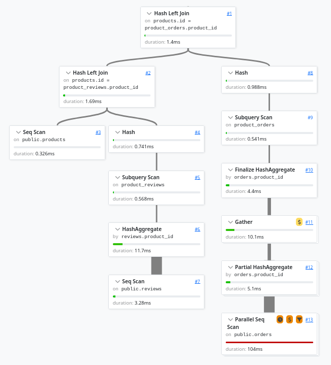
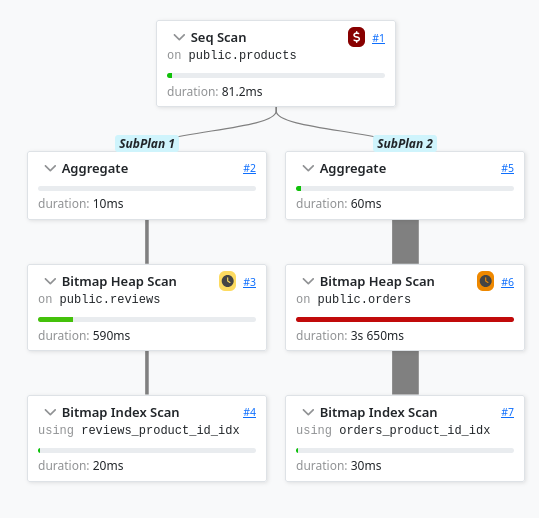
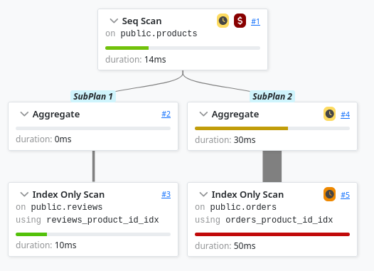
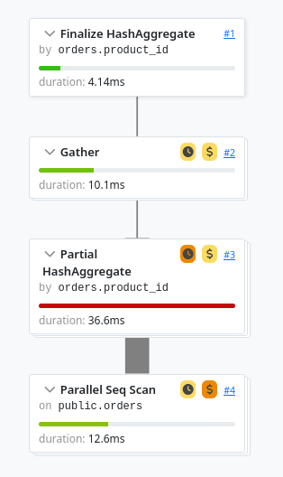

In my [first post](/posts/postgres-aggregates/), I expected to show
that there was a better alternative to subqueries for large,
multi-join queries. Here's a summary of the results, updated for
PostgreSQL 18:

| Query | Time |
|-------|-----:|
| Subquery | 500ms |
| Merged CTEs | 100ms |



```sql
SELECT
  products.id,
  products.name,
  (SELECT COUNT(id) FROM reviews WHERE product_id = products.id) AS num_reviews,
  (SELECT COUNT(id) FROM orders  WHERE product_id = products.id) AS num_orders
FROM products;
```





```sql
WITH product_reviews AS (
  SELECT product_id, COUNT(id) AS num_reviews
  FROM reviews
  GROUP BY product_id
),
product_orders AS (
  SELECT product_id, COUNT(id) AS num_orders
  FROM orders
  GROUP BY product_id
)
SELECT
  products.id,
  products.name,
  COALESCE(product_reviews.num_reviews, 0) AS num_reviews,
  COALESCE(product_orders.num_orders,   0) AS num_orders
FROM products
LEFT JOIN product_reviews ON products.id = product_reviews.product_id
LEFT JOIN product_orders  ON products.id = product_orders.product_id;
```




As I recently was sharing my postgres experience with a coworker,
I noted something weird in the subquery plan: each branch had a
Bitmap Index Scan followed by a Bitmap Heap Scan. This is a common
pattern, that we could say as "good enough". But when this is the
bottleneck of a query (as it is with 360ms), it's a common idea
to go and try replace these two blocks by a Index Only Scan.

The idea of a Bitmap Index Scan + Bitmap Heap Scan is to use the
index to filter (or prefilter) the rows from the index, which is
really fast, and then go fetch the actual data from the main Heap
memory (the table per se). For instance, instead of scanning 10GB
of data, and dumping 90% of it, you use the index to find the 10%
interesting rows, and then fetch the Heap blocks where the data
lives. Note that you will actual fetch more than 10% of the disk
data, because you are forced to load whole memory pages
(around ~8KB by default). The Bitmap Heap Scan is really good when
the chosen data lives close together, because you can fetch many
rows in a single page read.

However, when using subqueries, the independance between loops of
the query leads to a bad correlation of heap pages: you may access
several times during the query to the same heap page, but you will
pay the cost several times too (in a single Bitmap Heap Scan, it's
smart and groups data access from a single page).

The other weird thing is that the query shouldn't even need to make
a data fetch: the index is good enough to answer the query, we only
need to know how many rows were matched for each product.

## A simple fix

The original query contained `count(id)`, and replacing it with
`count(*)` indeed improved the plan. We now have an Index Only Scan,
and the query is down from 500ms to 100ms, equal to the previous best.
Also note that the subquery version gains more performance as we use
root table filters.


```sql
SELECT
  products.id,
  products.name,
  (SELECT COUNT(*) FROM reviews WHERE product_id = products.id) AS num_reviews,
  (SELECT COUNT(*) FROM orders  WHERE product_id = products.id) AS num_orders
FROM products;
```




| Query | Scan type | Time |
|-------|-----------|-----:|
| Subquery `count(id)` | Bitmap Index + Heap Scan | 500ms |
| Subquery `count(*)` | Index Only Scan | 100ms |
| Merged CTEs | Parallel Seq Scan | 100ms |

## Going further

I have mixed feelings about this updated version. When I discovered
this, I thought the whole point of my article collapsed. But now
that I did the work to show it, I'm not so sure. Here are some
updated limitations to the use of subqueries.


### Leaf filtering

The Subquery approach is better for root table filtering. If you
want to compute the same statistics, but only for products with
a price over 900 (the price is random between 0 and 1000), then
the Subquery approach will filter before running the subqueries,
and in this case reduce the number of subquery loops by 10x.


```sql
SELECT
  products.id,
  products.name,
  (SELECT COUNT(*) FROM reviews WHERE product_id = products.id) AS num_reviews,
  (SELECT COUNT(*) FROM orders  WHERE product_id = products.id) AS num_orders
FROM products
WHERE products.price > 900;
```





```sql
WITH product_reviews AS (
  SELECT product_id, COUNT(id) AS num_reviews
  FROM reviews
  GROUP BY product_id
),
product_orders AS (
  SELECT product_id, COUNT(id) AS num_orders
  FROM orders
  GROUP BY product_id
)
SELECT
  products.id,
  products.name,
  COALESCE(product_reviews.num_reviews, 0) AS num_reviews,
  COALESCE(product_orders.num_orders,   0) AS num_orders
FROM products
LEFT JOIN product_reviews ON products.id = product_reviews.product_id
LEFT JOIN product_orders  ON products.id = product_orders.product_id
WHERE products.price > 900;
```




| Query | No filter | Root filter (`price > 900`) |
|-------|----------:|----------------------------:|
| Subquery `count(*)` | 100ms | 15ms |
| Merged CTEs | 100ms | 75ms |

However, when the filtering is in a leaf table, the Index Only Scan
can no longer be used (`where customer_name ilike '%0'`). As
expected, the Subquery gets back its Bitmap Heap Scan, and duration goes up.
However, I can't explain why the CTE goes up too. The Parallel Seq Scan
goes from 10ms to 100ms, and it doesn't make any sense.


```sql
SELECT
  products.id,
  products.name,
  (SELECT COUNT(*) FROM reviews WHERE product_id = products.id) AS num_reviews,
  (SELECT COUNT(*) FROM orders  WHERE product_id = products.id AND customer_name ILIKE '%0') AS num_orders
FROM products;
```





```sql
WITH product_reviews AS (
  SELECT product_id, COUNT(id) AS num_reviews
  FROM reviews
  GROUP BY product_id
),
product_orders AS (
  SELECT product_id, COUNT(id) AS num_orders
  FROM orders
  WHERE customer_name ILIKE '%0'
  GROUP BY product_id
)
SELECT
  products.id,
  products.name,
  COALESCE(product_reviews.num_reviews, 0) AS num_reviews,
  COALESCE(product_orders.num_orders,   0) AS num_orders
FROM products
LEFT JOIN product_reviews ON products.id = product_reviews.product_id
LEFT JOIN product_orders  ON products.id = product_orders.product_id;
```




| Query | No filter | Leaf filter (`customer_name ilike '%0'`) |
|-------|----------:|-----------------------------------------:|
| Subquery `count(*)` | 100ms | 110ms |
| Merged CTEs | 100ms | 140ms |

### Disk usage

Another important aspect is disk usage. In the CTE version, we read
57MB from orders and 7MB from reviews. In the Subquery + Index Only
Scan, we read 230MB from orders and 160MB from reviews. And in the
Subquery + Bitmap Heap Scan, we read 230MB from orders index, 7600MB
from orders, 160MB from reviews index and 780MB from reviews. This
is explained by the very high number of uncorrelated loops.

In this setup, it's not much of an issue, because the data is small
(57MB to read all orders), I have much RAM available, and I'm the
only one using it. But this is not the case in production systems.
Obviously tables are much largers (can easily become tens of GBs),
and data read from disk may often be discarded to let other queries
cache disk pages. The global setting that controls how much memory
is allocated to caching disk data is called `shared_buffers` (128MB
on my machine).

In a simple AWS RDS setup, you can expect your disk to have a
~100MB/s read throughput, when your local setup may be 20x faster.

I can use docker-compose and blkio_config settings to limit the disk.
I will also use a much lower `shared_buffers` that can't cache all
my data, like 16MB.


```yaml
services:
  postgres:
    image: postgres:18
    restart: unless-stopped
    command: postgres -c shared_buffers=16MB -c track_io_timing=on
    environment:
      POSTGRES_HOST_AUTH_METHOD: trust
    ports:
      - "5432:5432"
    blkio_config:
      device_read_bps:
        - path: /dev/nvme0n1  # your disk device
          rate: '125mb'       # gp3 baseline throughput
      device_read_iops:
        - path: /dev/nvme0n1
          rate: 3000          # gp3 baseline IOPS
      device_write_bps:
        - path: /dev/nvme0n1
          rate: '125mb'
      device_write_iops:
        - path: /dev/nvme0n1
          rate: 3000
```



```sql
SELECT
  products.id,
  products.name,
  (SELECT COUNT(id) FROM reviews WHERE product_id = products.id) AS num_reviews,
  (SELECT COUNT(id) FROM orders  WHERE product_id = products.id) AS num_orders
FROM products;
```





```sql
SELECT
  products.id,
  products.name,
  (SELECT COUNT(*) FROM reviews WHERE product_id = products.id) AS num_reviews,
  (SELECT COUNT(*) FROM orders  WHERE product_id = products.id) AS num_orders
FROM products;
```





```sql
WITH product_reviews AS (
  SELECT product_id, COUNT(id) AS num_reviews
  FROM reviews
  GROUP BY product_id
),
product_orders AS (
  SELECT product_id, COUNT(id) AS num_orders
  FROM orders
  GROUP BY product_id
)
SELECT
  products.id,
  products.name,
  COALESCE(product_reviews.num_reviews, 0) AS num_reviews,
  COALESCE(product_orders.num_orders,   0) AS num_orders
FROM products
LEFT JOIN product_reviews ON products.id = product_reviews.product_id
LEFT JOIN product_orders  ON products.id = product_orders.product_id;
```




| Query | Scan type | Time (throttled disk) |
|-------|-----------|----------------------:|
| Subquery `count(id)` | Bitmap Heap Scan | 4200ms |
| Subquery `count(*)` | Index Only Scan | 100ms |
| Merged CTEs | Parallel Seq Scan | 90ms |

I think I can explain the numbers. CTE, as before, only need to read
once the data. So it's reading just the right amount from disk.
Subquery Index Only read less data (index) but many times. The index
fits in the cache, and the Shared Hit/Read ratio is very high (~x10).
Subquery Bitmap Heap Scan gets dirty. Data from tables can't fit in
cache, so each independant loop has a high chance of having to read
a page from disk. The Shared Hit/Read ratio is ~0.5, and total data
read from disk goes from 7.7MB in the previous case to 5.5GB.

## TODO

- disk usage data
