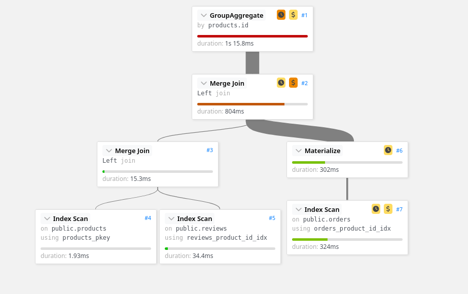
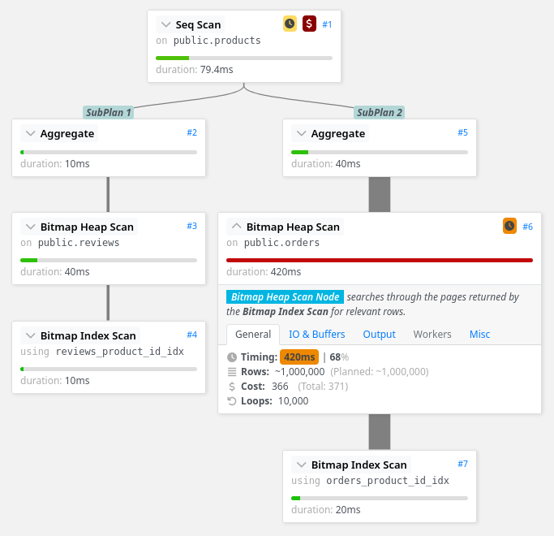
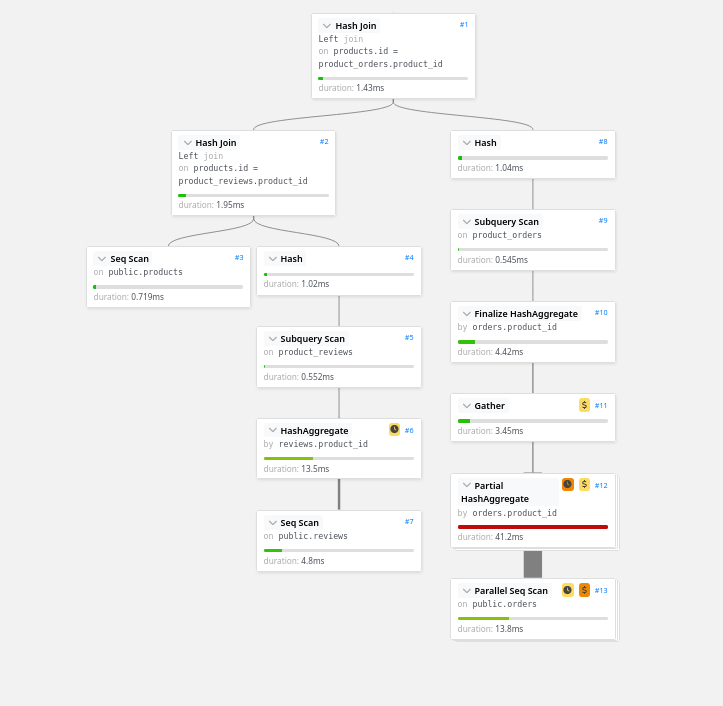

I recently stumbled upon a problem while crafting queries for PostgreSQL at work. What appeared to be be a simple problem to solve at first glance turned out to take many hours of refining. I also found it weird to not easily find accessible knowledge about this on the Internet. I decided to simplify the problem to its core and to write an article about my findings working it through.

Here is the simpler version of the problem:

- We a have a simple schema
  - We have 10k products
  - Each product has a mean of 100 orders, which makes for 1M orders
  - Each product has a mean of 10 reviews, which make for 100k reviews
- We want to make some efficient computations on multiples tables
- We want to build a UI where we display a list of products, along with their number of reviews, and their number of orders
- We only have basic indices on the foreign keys for a start

By the end of this reading, I hoope you will be able to:

- Analyze a slow query with easy to use tools
- Understand in what order are executed the different parts of a query

## Basics of PostgreSQL analysis

To solve today's problem, we are going to need several tools and concepts.

SQL is a query language: you write in this particular language what you want to be computed. This query is then processed by the **engine** - the actual computer that will do all the work. Since you didn't describe how to process the data, the engine will translate the query into processing steps it can execute. This is called a **query plan**[^wikipedia-query-plan].

The same query could be translated into different plans by different engines (Postgres, MySQL), different versions of the same engine (performance gains between two Postgres versions is often because of plan optimizations), or even the exact same engine, but with different underlying data.

<!-- TODO: Add scheme -->

We will see that there are several way to write a query that outputs the same results, but each way will guide the engine into different directions on what plan will be used. To understand how our query is translated by Postgres, we use `EXPLAIN ANALYSE` before our query to ask Postgres to output the plan instead of the results. The `ANALYZE` keyword will even add runtime data (timings, costs) to the plan, after executing the query.

We will then use a **vizualisation tool** to make it easier to read the plan. I use **Dalibo Explain**[^dalibo-explain], which is a free tool that can be used online. It is also open source and standalone, so you can download the HTML page to use it locally.

I will also use **hyperfine**[^hyperfine] to benchmark the different queries. You don't necessarily need it to test the queries at home.

## 1. Aggregation

My first approach to this problem was to use tools I was taught when learning SQL at school. If I want to summarize some information, aggregations are the way to go, right?

```sql
SELECT
  products.id AS product_id,
  COUNT(reviews.id) AS num_reviews
FROM
  products
LEFT JOIN reviews ON reviews.product_id = products.id
GROUP BY
  products.id;
```

With the above query, I get a single row for each product, with the correct count of reviews for each. Easy, isn’t it? I just had to use this pattern on several joins:

```sql
SELECT
  products.id AS product_id,
  COUNT(reviews.id) AS num_reviews,
  COUNT(orders.id) AS num_orders
FROM
  products
  LEFT JOIN reviews ON reviews.product_id = products.id
  LEFT JOIN orders ON orders.product_id = products.id
GROUP BY
  products.id;
```

But of course it’s not always that easy. This query give the wrong results, because before grouping and aggregating the rows, you get a single row for every couple of order and review for each product. You should quickly see that `num_reviews` and `num_orders` are the same, and have a mean value of 1000 instead of 100 or 10 as stated in the introduction.

```sql
SELECT
  products.id AS product_id,
  COUNT(DISTINCT reviews.id) AS num_reviews,
  COUNT(DISTINCT orders.id) AS num_orders
FROM
  products
  LEFT JOIN reviews ON reviews.product_id = products.id
  LEFT JOIN orders ON orders.product_id = products.id
GROUP BY
  products.id;
```

Adding the `DISTINCT` keyword here fixes this behaviour, and we finally get what we were looking for. Note that this fix only works here because the aggregation function is `COUNT`: it would not have worked if we were computing the average review rating.

Now that we found an obvious way to compute the correct result, let’s take a look at performances.

```txt
Benchmark 1: psql postgres://postgres@localhost:5432/postgres -f aggregation.sql
  Time (mean ± σ):      1.622 s ±  0.028 s    [User: 0.008 s, System: 0.005 s]
  Range (min … max):    1.590 s …  1.666 s    10 runs
```

On my computer, with the data provided in the introduction, I measured this query takes **1622ms** to execute. This seems too slow for a “web app” usage where you would need to query this data on demand for a user.

<!-- Reanalyse plan because of time diff (2.4 -> 1.6) -->

Using Dalibo, we can see what are the most costly parts of the query:



- On the right an index scan taking 300ms, and the intermediate materialization taking 300ms
- The merge join of 10M rows (size of reviews x products)

We can guess from this plan that all the data is merged into an enormous intermediate in-memory table, which is then processed for computing our aggregations. Let’s take these insights into account and try building a more efficient version.

## 2. Subqueries

We know that we want to avoid merging all the data together before making computations, because it adds a lot of memory pressure that slows the whole pipeline.

Going all the way to the opposite way of thinking, we can simply make a subquery to compute the two counts for each one of the products.

```sql
SELECT
  products.id,
  products.name,
  (
    SELECT count(id)
    FROM reviews
    WHERE product_id = products.id
  ) as num_reviews,
  (
    SELECT count(id)
    FROM orders
    WHERE product_id = products.id
  ) as num_orders
FROM
  products;
```

As a side effect, we can see that rewriting the query this way adds independence, and we don’t need to use `DISTINCT` to avoid counting some rows several times.

```text
Benchmark 1: psql postgres://postgres@localhost:5432/postgres -f subqueries.sql
  Time (mean ± σ):     607.0 ms ±   5.7 ms    [User: 16.5 ms, System: 4.1 ms]
  Range (min … max):   598.4 ms … 618.9 ms    10 runs
```

This query **takes now 607ms**. Sounds like a good speed-up

When we analyse the new query plan, we can see some major differences:



There are now subplans: because the subqueries reference a column of the outer query (`products.id`), these must be run for each row that is found in `products`. This is shown by the keywords `loops: 10000`. This is called a **correlated subquery**[^wiki-correlated-subquery].

These queries, even if numerous, are highly efficient because they can use the indexes we created to quickly find to corresponding rows: this is what the Bitmap Index Scan and Bitmap Heap Scan show.

## 3. Merging CTEs

We have seen two ways to think about this problem, both very different. What would be a better query is a query that avoids this enormous intermediate table, but also avoids having too many loops.

One way to achieve this is to split our computation into several parts. Basically, we can compute separately the reviews count and the orders count, because each aggregation is independent. We will have subqueries, but this time uncorrelated, so they will run only once each. We can use the **Common Table Expression**[^common-table-expressions] pattern to make it easier to read. Then in a final stage, we combine the results of our aggregations.

```sql
WITH product_reviews AS (
  SELECT
    product_id,
    count(id) AS num_reviews
  FROM
    reviews
  GROUP BY
    product_id
),
product_orders AS (
  SELECT
    product_id,
    count(id) AS num_orders
  FROM
    orders
  GROUP BY
    product_id
)
SELECT
  products.id,
  products.name,
  COALESCE(product_reviews.num_reviews, 0) AS num_reviews,
  COALESCE(product_orders.num_orders, 0) AS num_orders
FROM
  products
  LEFT JOIN product_reviews ON products.id = product_reviews.product_id
  LEFT JOIN product_orders ON products.id = product_orders.product_id;
```

Note that we have to use `COALESCE` because the aggregation may not have found any row for a given product, so the count would be `NULL` instead of 0.

```text
Benchmark 1: psql postgres://postgres@localhost:5432/postgres -f merging-ctes.sql
  Time (mean ± σ):      90.3 ms ±   2.4 ms    [User: 14.1 ms, System: 3.7 ms]
  Range (min … max):    85.8 ms …  94.5 ms    32 runs
```

This query takes **90ms**, which is an even greater speedup. What happenned this time?

- Get all the reviews, then aggregate by product id in one pass (HashAggregate)
- Same goes for orders, but width the addition of parallelism (cost CPU, but reduce time)
- The final merging stage is very fast because of the small size of the data at this point in the pipeline



One requirement for this usage is that the group by is on the product id : no need to load the product to group rows together. For instance, if we wanted to group by the product creation date, it would require intermediate join on the product table.

## 4. Adding filtering requirements

Now that we found a query that executes in 90ms, compared to the initial 1622ms, it seems that we found a good pattern.

But the last query has a drawback that the previous examples do not show: the two first stages have no clues about the products they are aggregating on.

If we slightly change the problem requirements, such as we only want to compute on a subsets of the products, this last query will still compute the aggregations over all reviews and orders, but drop most of the results in the last stage.

We can show this by adding a modulo filter on the product_id to only select 10% of the products, randomly. We can see that the two first queries perform almost linearly better, when the last one has a negligible improvement

| Query       | Time 100% (ms) | Time 10% (ms) |
| ----------- | -------------- | ------------- |
| Aggregation | 1622           | 184           |
| Subquery    | 607            | 69            |
| Merged CTE  | 90             | 75            |

## Wrapping up

This problem is a simplification of real issues I had at work: we were using a query base on correlated subqueries, and we run into some performance issues.

I though that using aggregations would solve it, but in fact it slowed down, and even added bugs from couting duplicate rows.

There is not a single way good way to write queries, but here are the takeaways I got from this experience:

- Avoid queries which use aggregation functions on several "directions": you will likely shoot yourself in the foot and obtain wrong results
- When fetching a lot of data, it is efficient to aggregate each "direction" alone, before mergin all results together with the main table: it will leverage parallelism and reduce the memory used
- When selecting only a subset of the main table, using subqueries will see the most impressive speed gains (if the filter depends on the main table data: filtering products based on the number of reviews they received will append after having computed all the data)

But in the end, you should always rely on benchmarking to compare different solutions!

## Resources

[^wikipedia-query-plan]: https://en.wikipedia.org/wiki/Query_plan
[^hyperfine]: https://github.com/sharkdp/hyperfine A command-line benchmarking tool
[^dalibo-explain]: https://explain.dalibo.com/ PostgreSQL execution plan visualizer
[^wiki-correlated-subquery]: https://en.wikipedia.org/wiki/Correlated_subquery
[^common-table-expressions]: https://www.postgresql.org/docs/current/queries-with.html
