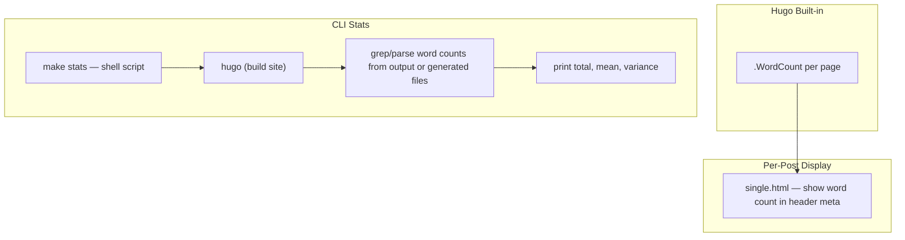

# ADR: Word Count Indication for Blog Posts

## 0. Solution

Two changes:

1. **Per-post word count in Hugo template** — add `{{ .WordCount }}` to `layouts/_default/single.html` next to the existing reading time display.
2. **Post-build stats command** — add a `make stats` target that runs `hugo list all` + `hugo` to compute and print total, mean, and variance of word counts across published (non-draft) posts to the terminal.

## 1. Context & Scope

This is a Hugo v0.155.2 blog with 4 posts (total ~5,500 raw words across markdown files). Hugo already provides built-in `.WordCount` and `.ReadingTime` page variables — `.ReadingTime` is already displayed in `layouts/_default/single.html`.

The goal is twofold:
- **Per-post word count** — visible to the author (and optionally readers)
- **Aggregate word count** — total words across all blog posts, for personal tracking

Key files:
- `layouts/_default/single.html` — single post template (already shows reading time)
- `layouts/partials/list/default.html` — post card in list view
- `layouts/posts/list.html` — posts list page
- `content/posts/*/index.md` — post content

Note: Hugo's `.WordCount` counts rendered content words (excluding front matter, code fences, HTML tags), which differs from raw `wc -w` on the markdown file.

## 2. Goals & Non-Goals

**Goals:**
- Show word count per blog post
- Track total word count across all posts
- Low maintenance — leverage Hugo built-ins where possible

**Non-Goals:**
- Real-time / live-updating word count during writing (IDE concern)
- Per-section or per-heading word counts
- Historical word count tracking over time (git can do this)

## 3. Design

Two independent pieces:
- **Template change**: one line in `single.html` to show `.WordCount`.
- **Makefile target**: a `make stats` command that builds the site, extracts per-post word counts (non-draft), and prints total/mean/variance. Hugo can output word counts via a custom layout that writes to a known file, or we use a shell script that calls Hugo's template engine to dump counts.

## 4. Alternatives (for the stats command)

### A. Hugo custom output format (recommended)

Add a custom output format (e.g. `stats`) that produces a plain-text or JSON file with word counts per post during `hugo build`. A shell script in `make stats` parses that file and computes total/mean/variance.

| Pros | Cons |
|------|------|
| Word counts from Hugo's own `.WordCount` — consistent with what's displayed | Requires a custom output format + template |
| Single source of truth | Slightly more Hugo config |

### B. Shell script with `wc -w`

`make stats` runs `wc -w` on all non-draft `index.md` files and computes stats with `awk`.

| Pros | Cons |
|------|------|
| No Hugo config changes | Counts differ from Hugo's `.WordCount` (includes front matter, URLs, markdown syntax) |
| Very simple | Must parse front matter to detect `draft: true` |

### C. Python script

Use Python (already in the project for tests) to parse markdown, strip front matter, count words, compute stats.

| Pros | Cons |
|------|------|
| Full control, can match Hugo's counting closely | Overkill, another dependency on counting logic |
| Could reuse pyproject.toml setup | |

## 5. Open Questions

All resolved:

1. ~~Where to show per-post word count?~~ → **Single post page only**, in header meta.
2. ~~Where to show aggregate?~~ → **Not displayed on site**. CLI `make stats` for total/mean/variance.
3. ~~Include drafts in aggregate?~~ → **No**, exclude drafts.
4. ~~CLI command?~~ → **Yes**, `make stats`.
5. ~~Hugo vs raw word count?~~ → **Hugo's `.WordCount`** is fine.

**Remaining:** None — Alternative A selected for stats command.

## 6. Parties Involved

- **Author:** Kagamino (Martin Lehoux)

## 7. Cross Concerns

- **Performance:** `.WordCount` and `range` are negligible for a small blog.
- **Accuracy:** Hugo's `.WordCount` strips HTML/shortcodes and counts rendered text words. Code blocks are included in the count. This is generally more meaningful than raw `wc -w` which includes front matter YAML, URLs, and markdown syntax.
